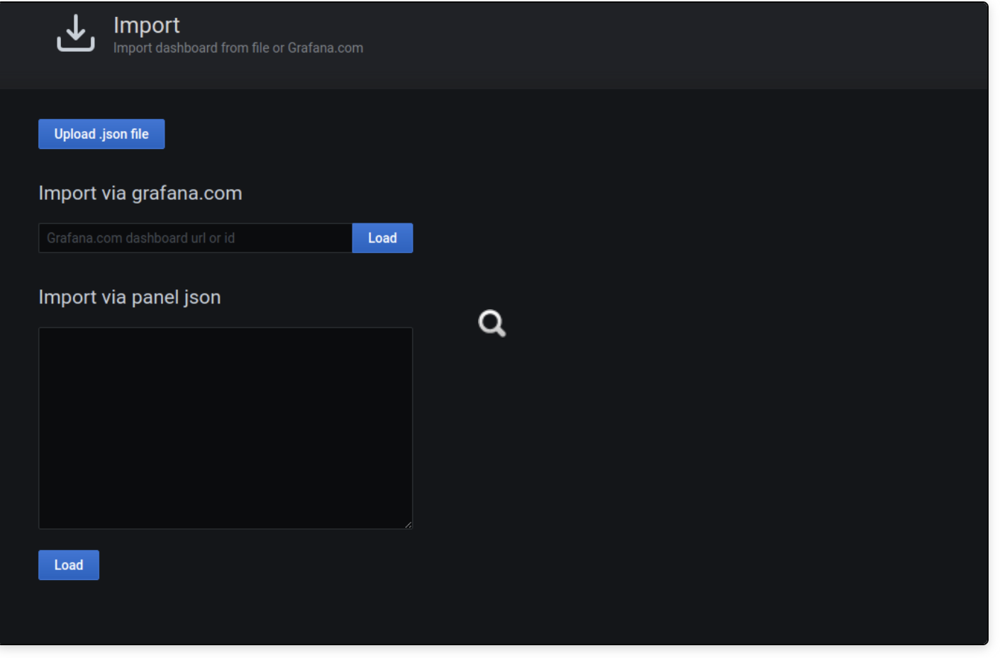
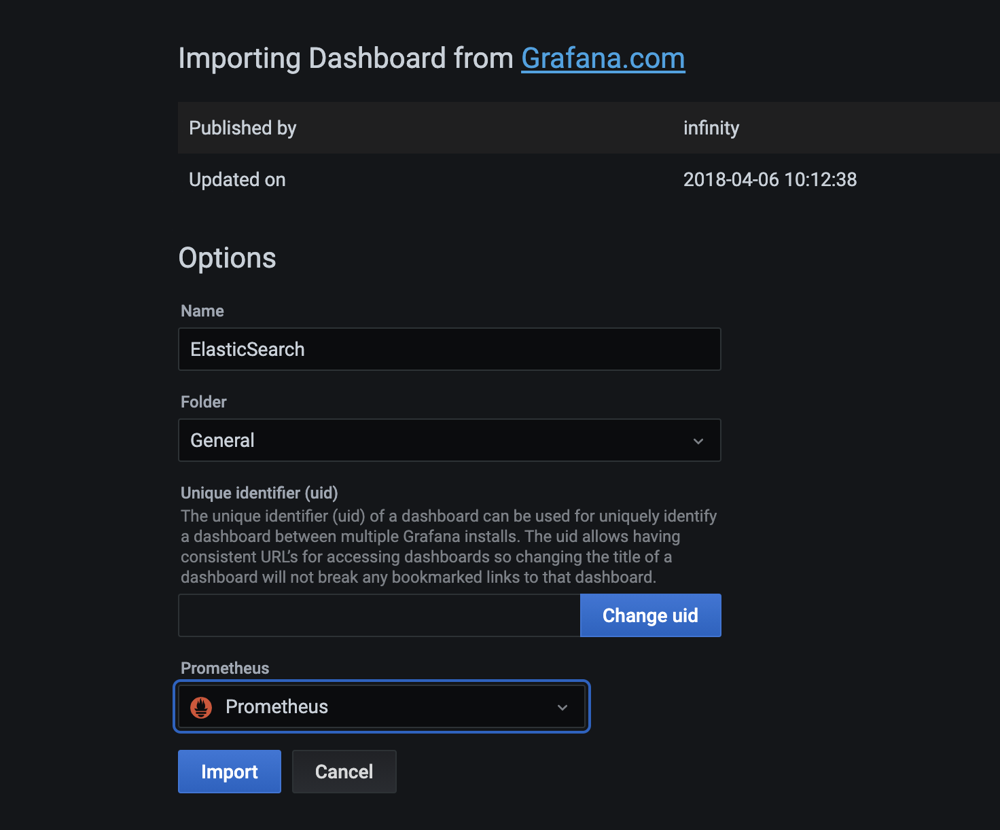
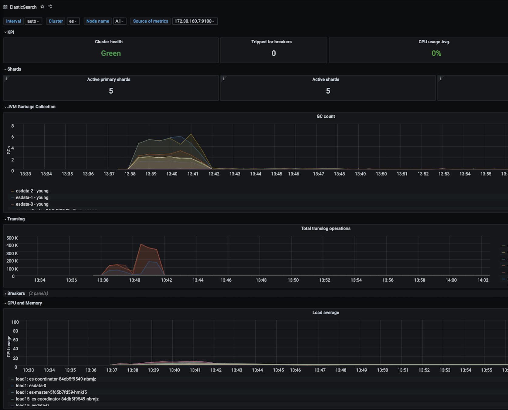

# Elasticsearch

Elasticsearch is a distributed, RESTful search and analytics engine, most
popularly used to aggregate logs, but also to serve as search backend to a
number of different applications.

## Note

This example deployment requires a certain amount of resources as it will be
deploying

- 3x data nodes
- 3x coordinator nodes
- 3x master nodes

requiring a combined ~14GB of memory (minimum), however, more memory may be
used by the application/s.

> You can change the memory application settings in the env variables passed to
> the ES container in `10-es-data.yaml`, `20-es-coordinator.yaml` and
> `30-es-master.yaml`.

## Install

Apply the Elasticsearch manifests

```bash
kubectl apply -f .
```

## Connect

To connect to ES, simply use the following port-forward command

```bash
kubectl port-forward svc/elasticsearch 9200
```

which will make ES available via [http://localhost:9200](http://localhost:9200)

### Note max_map_count

ES requires to set a higher than default max_map_count in the system running
the application. Because of that, the ES bootstrap initially applies that
parameter change. That requires an init container to run as privileged in your
system. In case you rather not set a privileged container for that purpose, you
can remove the `initContainers` section of `10-es-data.yaml`,
`20-es-coordinator.yaml` and `30-es-master.yaml`. Additionally you have to set
the max_map_count for each machine that will run any of the ES Pods by:

```bash
echo 262144 > /proc/sys/vm/max_map_count
```

or

```bash
sysctl -w vm.max_map_count=262144
```

> This setting needs to be applied on _every_ node that will be running an ES
> Pod if your remove the initContainer, so effectively on every node in your
> cluster.


## Monitoring Elasticsearch

It is not possible to scrape directly from elasticsearch just using Prometheus, you wil need an exporter such as [https://github.com/justwatchcom/elasticsearch_exporter](https://github.com/justwatchcom/elasticsearch_exporter), this is a Prometheus exporter which is written in Go and will scrape all metrics from Elasticsearch and expose them so you can use with Prometheus.

[Elasticsearch Exporter](./77-es-exporter.yaml) and its [Servicemonitor](./78-servicemonitor.yaml) have been included when installing everything from this directory.

There are some really excellent dashboards in the community which should give you everything you need to view all required metrics, here is an [example dashboard](./dashboard/exporter.json), the original source for this can be found [here](https://grafana.com/grafana/dashboards/2322).


To install this dashboard, you will need to have deployed [Prometheus Operator](../prometheus).. once this is all up and running, log in to Grafana;

```bash
kubectl port-forward svc/prometheus-grafana 8080:80
```

Then just browse to [localhost:8080](localhost:8080), log in to Grafana, on the right hand side, just hit the `+` symbol, you should then see the options to import the dashboards. You can either import the url code `2322`, or copy and paste the json file:







