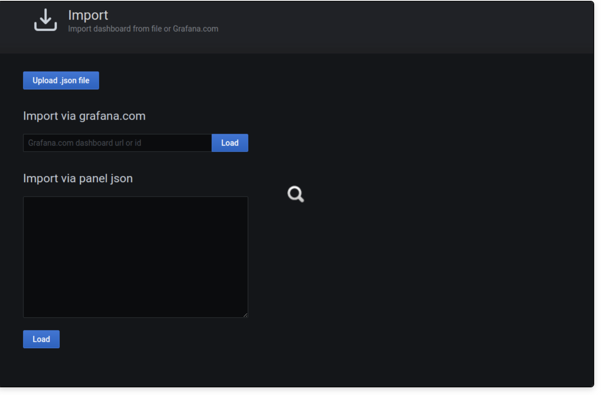
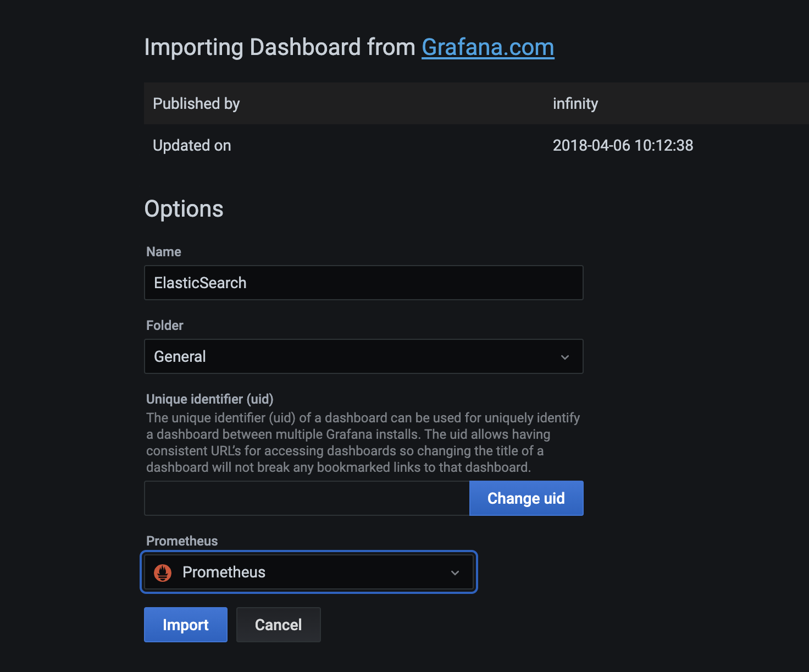

# Kafka

Kafka is a distributed streaming/mesaging platform which requires high throughput and low latency to handle large amounts of data feeds. This would be an ideal candidate for Cloud Native storage.

## Deploying Kafka

To deploy kafka, run the following helm chart commands:

```bash
helm repo add incubator http://storage.googleapis.com/kubernetes-charts-incubator
kubectl create ns kafka
$ helm install my-kafka incubator/kafka --namespace kafka --values values.yaml
```

This will deploy the following:

- kafka brokers statefulset with jmx exporter config
- zookeeper statefulset (maintains kafka leader-follower, broker list, partitions, topics)
- kafka exporter - scrape resource metrics

## Performance Testing Kafka

To test performance, deploy test clients for kafka and zookeeper:

```bash
kubectl create -f kafka-test-client.yaml

kubectl create -f zookeeper-test-client.yaml
```

**TIP!** - there are 2 grafana dashboards which will be useful to monitor the performance of kafka [here](./dashboards). These make use of the exposed metrics created by the kafka exporter (this is part of the helm chart)


### Test 1

```bash
# exec on to the kafka-test-client
kubectl exec -it kafka-test-client -n kafka /bin/bash

## Create Topic
kafka-topics --zookeeper my-kafka-zookeeper:2181 --create --topic test-rep-one --partitions 6 --replication-factor 1

## Producer
kafka-run-class org.apache.kafka.tools.ProducerPerformance --print-metrics --topic test-rep-one --num-records 600000 --throughput 100000000 --record-size 10000 --producer-props bootstrap.servers=my-kafka:9092 buffer.memory=67108864 batch.size=819600

## Consumer
kafka-consumer-perf-test --broker-list my-kafka:9092 --messages 600000 --threads 4 --topic test-rep-one --print-metrics
```


### Test 2


```bash
# exec on to the kafka-test-client
kubectl exec -it kafka-test-client -n kafka /bin/bash

## Create Topic
kafka-topics --zookeeper my-kafka-zookeeper:2181 --create --topic test-rep-two --partitions 6 --replication-factor 2

## Producer
kafka-run-class org.apache.kafka.tools.ProducerPerformance --print-metrics --topic test-rep-two --num-records 60000000 --throughput -1 --record-size 100 --producer-props bootstrap.servers=my-kafka:9092 buffer.memory=67108864 batch.size=8196

## Consumer
kafka-consumer-perf-test --broker-list my-kafka:9092 --messages 60000000 --threads 4 --topic test-rep-two --print-metrics
```

### Test 3


```bash
# exec on to the kafka-test-client
kubectl exec -it kafka-test-client -n kafka /bin/bash

## Create Topic
kafka-topics --zookeeper my-kafka-zookeeper:2181 --create --topic test-rep-three --partitions 6 --replication-factor 1

## Producer
kafka-run-class org.apache.kafka.tools.ProducerPerformance --print-metrics --topic test-rep-three --num-records 60000000 --throughput 100000000 --record-size 100 --producer-props bootstrap.servers=my-kafka:9092 buffer.memory=67108864 batch.size=8196

## Consumer
kafka-consumer-perf-test --broker-list my-kafka:9092 --messages 60000000 --threads 4 --topic test-rep-three --print-metrics
```

### Test 4
```bash
# exec on to the kafka-test-client
kubectl exec -it kafka-test-client -n kafka /bin/bash

## Create Topic
kafka-topics --zookeeper my-kafka-zookeeper:2181 --create --topic test-rep-four --partitions 6 --replication-factor 1

## Producer
kafka-run-class org.apache.kafka.tools.ProducerPerformance --print-metrics --topic test-rep-four --num-records 60000000 --throughput -1 --record-size 100 --producer-props bootstrap.servers=my-kafka:9092 buffer.memory=67108864 batch.size=8196

## Consumer
kafka-consumer-perf-test --broker-list my-kafka:9092 --messages 60000000 --threads 4 --topic test-rep-four --print-metrics
```


## Concurrent tests

In this case its bests to re-deploy kafka, just in case you run out of disk space.

Before we deploy our performance tests, we need to create the topics, to do this deploy the kafka test client and create all 4 topics:

```bash

kubectl exec -it kafka-test-client -n kafka /bin/bash
# When on the client run:
kafka-topics --zookeeper my-kafka-zookeeper:2181 --create --topic test-rep-one --partitions 6 --replication-factor 1
kafka-topics --zookeeper my-kafka-zookeeper:2181 --create --topic test-rep-two --partitions 6 --replication-factor 2
kafka-topics --zookeeper my-kafka-zookeeper:2181 --create --topic test-rep-three --partitions 6 --replication-factor 2
kafka-topics --zookeeper my-kafka-zookeeper:2181 --create --topic test-rep-four --partitions 6 --replication-factor 2
```

Now we can run the k8s job to run 4 parallel performance tests:

```bash
kubectl create -f ./multi-jobs/producers.yaml
# wait for these to finish, you can also monitor in grafana
# once all have completed, run the consumers job:
kubectl create -f ./multi-jobs/consmers.yaml
```


## Monitor Kafka

When using the Kafka Helm chart, you can enable (these are already enabled by default) service monitors for the jmx exporter (to monitor mBeans from the Kafka jvm), there is also one for a Kafka exporter deployment which exposes metrics for the topcs and consumer groups.

There are plenty of useful dashboards in the community, so you shouldn't have to write anything from scratch, you can view them locally [here](./dashboards) or try these links:

[kafka exporter](https://grafana.com/grafana/dashboards/7589)

[kafka jmx exporter](https://grafana.com/grafana/dashboards/10123)

To install these dashboards, you will need to have deployed [Prometheus Operator](../prometheus).. once this is all up and running, log in to Grafana:

```bash
kubectl port-forward svc/prometheus-grafana 8080:80
```

Then just browse to [localhost:8080](localhost:8080), log in to Grafana, on the right hand side, just hit the `+` symbol, you should then see the options to import the dashboards. You can either import the url code `10123` for the jmx exporter and `7589` for kafka exporter, or copy and paste the json files:



