# White Paper - Cloud Native Storage

Table of Contents
-----------------

-   [Introduction](#introduction)
    - [Why Local Storage](#why-local-storage)
    - [Storage Solutions](#storage-solutions)
-   [Benchmark Overview](#benchmark-overview)
-   [Benchmark Tests](#benchmark-tests)
    - [FIO](#fio)
      -   [Portworx](#portworx)
      -   [Longhorn](#longhorn)
      -   [StorageOS](#storageos)
      -   [Linstor](#linstor)
    - [Kafka](#kafka)
      -   [StorageOS](#storageos-1)
      -   [Portworx](#portworx-1)
      -   [Linstor](#linstor-1)
      -   [Longhorn](#longhorn-1)
    - [Postgres](#postgres)
      -   [Longhorn](#longhorn-2)
      -   [StorageOS](#storageos-2)
      -   [Linstor](#linstor-2)
      -   [Portworx](#portworx-2)
    - [Elasticsearch](#elasticsearch)
      -   [StorageOS](#storageos-3)
      -   [Linstor](#es-linsto-3)
    - [Failover Planned](#failover-planned)
      -   [linstor](#linstor-4)
      -   [StorageOS](#storageos-4)
    - [Failover Unplanned](#failover-unplanned)
      -   [StorageOS](#storageos-5)
      -   [Linstor](#linstor-5)
    - [Kafka Concurrent Tests](#kafka-concurrent-tests)
      -   [StorageOS](#storageos-6)
      -   [Linstor](#linstor-6)


## Introduction

This repo contains a run through of Cloud Native storage solutions that can be implemented to manage local attached storage in a Kubernetes cluster.

### Why Local Storage?

Distributed systems such as messaging/data streaming services (RabbitMQ, Kafka), search engines (Elasticsearch), database backends (Postgres/MySQL/Cassandra) require high performance, low latency, high throughput (iops & bw), they also need to be resilient, scalable and highly available.

We can surely achieve some of this using dedicated hardware/network storage, however, we will see some degredation in performance when compared to using local storage (we will be comparing this same tests soon on hardware storage TBC).

Local storage gives us the best performance but at the same time adds more complexity. We now need to manage each Kubernetes nodes carefully as they will now become stateful.

How do we avoid turning our Kubernetes nodes from cattle to pets? We will see different ways to achieve this below..

### Storage Solutions

Our goal was to investigate different storage solutions that could take advantage of local storage and give the best of both worlds with performance, resiliency and scalability.

What to look out for:

- Easy/simple to implement
- Provides a way we can asynchronously replicate data, allowing us to swap out nodes across failure domains without worry of downtime
- Be topology aware, understand failure domains so we can achieve the above
- Manage scheduling of stateful pods
  - to ensure pods and storage are co-located
  - to ensure pods can be smartly scheduled on nodes with more capacity and less traffic
- Provide strong encryption in transit and at rest


These are some of the solutions that are out there and he ones that stod out the most in the community:

- Linstor
- StorageOS
- Portworx
- Ceph
- Longhorn
- Robin

Each of these offer pro's and con's, details of which can be found here [Review-CN-Storage](./Review-CN-Storage.md)

After inital review, based on maturity of the product, features, potential cost, the solutions have been narrowed down to the following:

- Linstor
- StorageOS
- Longhorn

Unfortunately Portworx provides the most mature, feature rich product but the price structure is significantly higher than the others. For this reason it was mainly used to comparitavely benchmark the other products.

## Benchmark Overview

As mentioned above, when thinking about using local storage, our use cases were for distributed systems that would be heavily used by other applications such as Kafka, Elasticsearch, Posgtres.

We wanted to develop tests that would give an accurate as possible indication on how well these would perform under heavy load. Below is some common that can be used to achieve this.

Here is a quick overview of each of the tests, (more details and links to results can be found further down this page).

- **Kafka Tests** - we used a Kafka test client to run various tests.
  - creating lots of records ()/thousands/millions: these ranged from small chunks (to push the iops), to large chunks (to push the bandwidth) and really find the limits of each solution

- **Elasticsearch Tests** - we used esrally, which is an Elasticsearch performance tool. This creates real world data and runs performance tests on that data. Once tests have complete, you can view output on logs, this cotains a lot of useful data, indexing time, throughput, latency, all details have been recorded for each solution (links below)

- **Postgres Tests** - PGbench was used to run and simulate multiple SQL commands which could then calculate transactions per second and latency. 2 tests were run, a small test (1 client, 1 thread, 10 transactions), then a much larger test (100 clients, 4 threads, 10000 transactions per client)

- **FIO Tests** - This tool can be used to generate IO workloads, sequential/random read/writes, bandwidth. This is a generic tool which is not application specific but creates files (must provide size fo data, in this case it was 10GB) and then it will carry out the different tests.

- **Failover Tests** - a combination of planned and unplanned failovers were committed and whilst Elasticsearch was deployed in to the cluster and the same esRally tests were performance. Planned failover involved draining a worker node during the esRally tests, unplanned involved powering off a worker node without warning. Performance was then compared between solutions and how they also faired to their previous results.


## Benchmark Tests

Each product was deployed in to a Kubernetes cluster in Packet, which offers bare metal as a service.

Spec for each bare metal host:

```
c2.medium
PROC1 x AMD EPYC 7401P 24-Core Processor @ 2.0GHzRAM64GB
DISK2 x 120GB SSD
DISK2 x 480GB SSD
NIC2 x 10Gbps Bonded Ports
```

The following tests were then performed on each:


### FIO

FIO is a benchmarking tool which is used to test iops, latency and bandwidth. Full details can be found [here](https://fio.readthedocs.io/en/latest/fio_doc.html)

You can find steps to build a docker image which has FIO installed, as well as an entrypoint script which is used to run various benchmark tests [here](../fio-test). These have parameters which allow this to deployed as a kubernetes job and can be fine tuned dependant on requirements.

Here's a snippet of some of the values that can be changed:

```yaml
      containers:
      - name: fio-test
        image: <repo>/fiotest:1.0.0
        imagePullPolicy: Always
        env:
          - name: FIO_MOUNTPOINT
            value: /data
          # - name: FIO_QUICK
          #   value: "yes"
          - name: FIO_SIZE
            value: 10G
          - name: RUN_TIME
            value: 900s
          # - name: FIO_OFFSET_INCREMENT
          #   value: 256M
          # - name: FIO_DIRECT
          #   value: "0"
```

Also note the size of the pvc, if you want to just run a quick test, keep this around 2GB.

These were the results on each solution using FIO size of 10G and PVC as 50Gi (for full output please take a look [here](../fio-test))

#### Portworx:

```log
==================
= FIO Summary =
==================
Random Read/Write IOPS: 55.6k/10.9k. BW: 882MiB/s / 418MiB/s
Average Latency (usec) Read/Write: 204.51/397.01
Sequential Read/Write: 944MiB/s / 802MiB/s
Mixed Random Read/Write IOPS: 28.6k/9529
```

#### Longhorn:

```log
==================
= FIO Summary =
==================
Random Read/Write IOPS: 21.9k/3339. BW: 500MiB/s / 227MiB/s
Average Latency (usec) Read/Write: 525.72/1218.45
Sequential Read/Write: 721MiB/s / 176MiB/s
Mixed Random Read/Write IOPS: 5012/1671
```

#### StorageOS:

```log
==================
= FIO Summary =
==================
Random Read/Write IOPS: 85.4k/24.8k. BW: 801MiB/s / 158MiB/s
Average Latency (usec) Read/Write: 84.24/403.94
Sequential Read/Write: 1069MiB/s / 149MiB/s
Mixed Random Read/Write IOPS: 42.4k/14.2k
```

#### Linstor:

```log
==================
= FIO Summary =
==================
Random Read/Write IOPS: 70.8k/30.2k. BW: 438MiB/s / 315MiB/s
Average Latency (usec) Read/Write: 151.90/565.08
Sequential Read/Write: 523MiB/s / 306MiB/s
Mixed Random Read/Write IOPS: 25.6k/8508
```

1. StorageOS
2. Linstor
3. Portworx
4. Longhorn

----------

### Kafka

For Kafka, this was deployed using [this helm chart](https://github.com/helm/charts/tree/master/incubator/kafka) helm chart.

For full details on how to deploy, including an example **values** file, please go to [this Kafka](../kafka) directory. You will also find full details of how kafka was tested and full log outputs of resultes, as well as grafana dashboards which were used to show the overall performance of the kubernetes cluster and kafka (using JMX/Kafka exporter metrics).

#### StorageOS

Full log outputs and dashboards can be found [here](../kafka/perf-test-results/storageOS)

Exporter Dashboard:

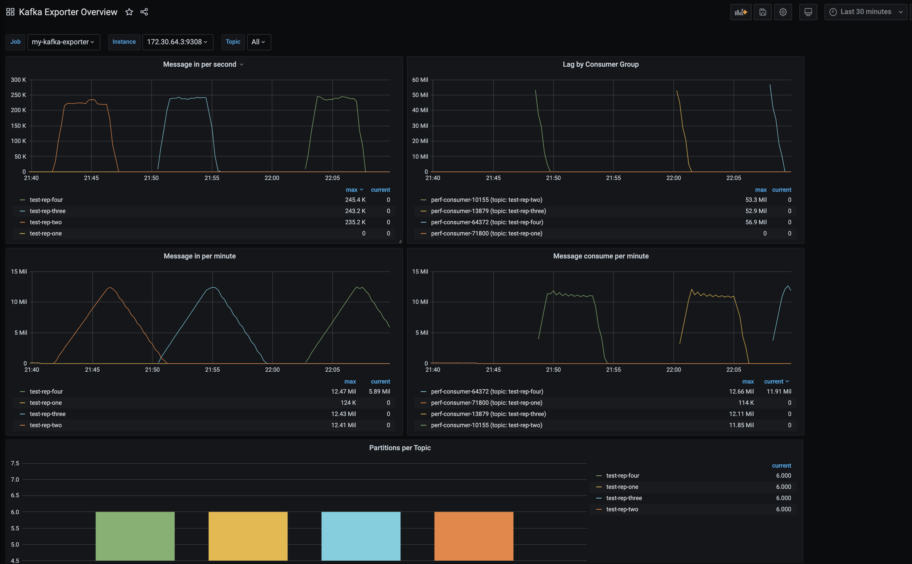


Producer test 2 (full log output [here](../kafka/perf-test-results/storageOS/test2/producer.log)):
```log
60000000 records sent, 222707.229077 records/sec (21.24 MB/sec), 46.02 ms avg latency, 776.00 ms max latency
```
Consumer test 2 (full log output [here](../kafka/perf-test-results/storageOS/test2/consumer.log):
```log
start.time, end.time, data.consumed.in.MB, MB.sec, data.consumed.in.nMsg, nMsg.sec, rebalance.time.ms, fetch.time.ms, fetch.MB.sec, fetch.nMsg.sec
2020-06-23 20:48:08:163, 2020-06-23 20:49:27:342, 5722.0459, 72.2672, 60000000, 757776.6832, 3040, 76139, 75.1526, 788032.4144
```

#### Portworx

Full log outputs and dashboards can be found [here](../kafka/perf-test-results/portworx)

Exporter Dashboard:

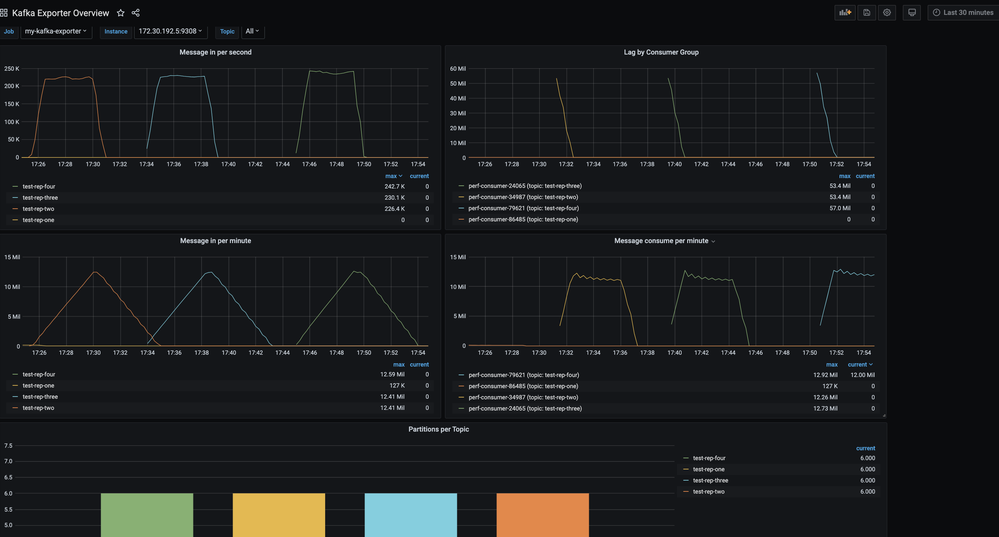

Producer test 2 (full log output [here](../kafka/perf-test-results/portworx/test2/producer.log)):
```log
60000000 records sent, 220512.028931 records/sec (21.03 MB/sec), 37.87 ms avg latency, 896.00 ms max latency
```
Consumer test 2 (full log output [here](../kafka/perf-test-results/portworx/test2/consumer.log)):
```log
start.time, end.time, data.consumed.in.MB, MB.sec, data.consumed.in.nMsg, nMsg.sec, rebalance.time.ms, fetch.time.ms, fetch.MB.sec, fetch.nMsg.sec
2020-06-24 16:30:53:242, 2020-06-24 16:32:14:872, 5722.0459, 70.0973, 60000000, 735023.8883, 3031, 78599, 72.8005, 763368.4907
```

#### Linstor

Full log outputs and dashboards can be found [here](../kafka/perf-test-results/linstor)

Exporter Dashboard:

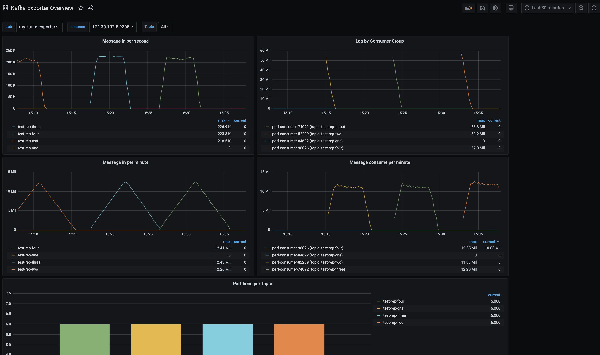

Producer test 2 (full log output [here](../kafka/perf-test-results/linstor/test2/producer.log)):
```log
60000000 records sent, 207614.611916 records/sec (19.80 MB/sec), 124.92 ms avg latency, 2186.00 ms max latency
```
Consumer test 2 (full log output [here](../kafka/perf-test-results/portworx/test2/consumer.log)):
```log
start.time, end.time, data.consumed.in.MB, MB.sec, data.consumed.in.nMsg, nMsg.sec, rebalance.time.ms, fetch.time.ms, fetch.MB.sec, fetch.nMsg.sec
2020-06-24 14:14:37:863, 2020-06-24 14:16:02:365, 5722.0459, 67.7149, 60000000, 710042.3659, 3049, 81453, 70.2497, 736621.1189
```

**Longhorn**

Full log outputs and dashboards can be found [here](../kafka/perf-test-results/longhorn)

Exporter Dashboard:

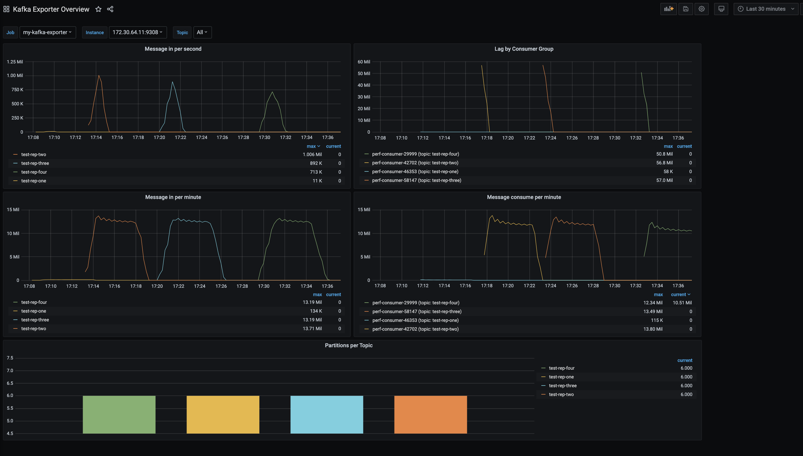

Producer test 2 (full log output [here](../kafka/perf-test-results/longhorn/test2/producer.log)):
```log
60000000 records sent, 805974.961045 records/sec (76.86 MB/sec), 55.96 ms avg latency, 1006.00 ms max latency
```
Consumer test 2 (full log output [here](../kafka/perf-test-results/longhorn/test2/consumer.log)):
```log
start.time, end.time, data.consumed.in.MB, MB.sec, data.consumed.in.nMsg, nMsg.sec, rebalance.time.ms, fetch.time.ms, fetch.MB.sec, fetch.nMsg.sec
2020-06-23 16:17:10:251, 2020-06-23 16:18:10:448, 5722.0459, 95.0553, 60000000, 996727.4117, 3019, 57178, 100.0743, 1049354.6469
```

1. Longhorn
2. StorageOS
3. Portworx
4. Linstor

----------

### Postgres

Postgres was deployed using a statefulset and a pvc with a 200Gi volume.

PGBench was used to benchmark the performance that could be achieved. 2 tests were ran, here are the results:

#### Longhorn

Small test (full log output [here](../postgres/pgbench-results/longhorn/small-test.log)):
```log
scaling factor: 400
query mode: simple
number of clients: 1
number of threads: 1
number of transactions per client: 10
number of transactions actually processed: 10/10
latency average = 2.422 ms
tps = 412.891957 (including connections establishing)
tps = 476.719771 (excluding connections establishing)
```
Big test (full log output [here](../postgres/pgbench-results/longhorn/big-test.log)):
```log
scaling factor: 400
query mode: simple
number of clients: 100
number of threads: 4
number of transactions per client: 10000
number of transactions actually processed: 750000/1000000
latency average = 39.710 ms
tps = 2518.227768 (including connections establishing)
tps = 2518.247208 (excluding connections establishing)
```

#### StorageOS

Small test (full log output [here](../postgres/pgbench-results/storageOS/small-test.log)):
```
scaling factor: 400
query mode: simple
number of clients: 1
number of threads: 1
number of transactions per client: 10
number of transactions actually processed: 10/10
latency average = 3.286 ms
tps = 304.345602 (including connections establishing)
tps = 350.591799 (excluding connections establishing)
```
Big test (full log output [here](../postgres/pgbench-results/storageOS/big-test.log)):
```log
scaling factor: 400
query mode: simple
number of clients: 100
number of threads: 4
number of transactions per client: 10000
number of transactions actually processed: 500000/1000000
latency average = 32.508 ms
tps = 3076.181516 (including connections establishing)
tps = 3076.210068 (excluding connections establishing)
```

#### Linstor

Small test (full log output [here](../postgres/pgbench-results/linstor/small-test.log)):
```log
scaling factor: 400
query mode: simple
number of clients: 1
number of threads: 1
number of transactions per client: 10
number of transactions actually processed: 10/10
latency average = 2.515 ms
tps = 397.591423 (including connections establishing)
tps = 462.938787 (excluding connections establishing)
```
Big test (full log output [here](../postgres/pgbench-results/linstor/big-test.log)):
```log
scaling factor: 400
query mode: simple
number of clients: 100
number of threads: 4
number of transactions per client: 10000
number of transactions actually processed: 750000/1000000
latency average = 18.289 ms
tps = 5467.655154 (including connections establishing)
tps = 5467.773729 (excluding connections establishing)
```

#### Portworx

Small test (full log output [here](../postgres/pgbench-results/portworx/small-test.log)):
```log
scaling factor: 400
query mode: simple
number of clients: 1
number of threads: 1
number of transactions per client: 10
number of transactions actually processed: 10/10
latency average = 7.977 ms
tps = 125.356847 (including connections establishing)
tps = 132.623884 (excluding connections establishing)
```
Big test (full log output [here](../postgres/pgbench-results/portworx/big-test.log)):
```log
scaling factor: 400
query mode: simple
number of clients: 100
number of threads: 4
number of transactions per client: 10000
number of transactions actually processed: 750000/1000000
latency average = 58.801 ms
tps = 1700.660145 (including connections establishing)
tps = 1700.670399 (excluding connections establishing)
```
All big tests failed due to the following error:
```bash
connection to database "userdb" failed:
FATAL:  remaining connection slots are reserved for non-replication superuser connections
```
To get the full log outputs and to see grafana dashboards showing overall cluster performance, take a look in [here](./postgres)

1. Linstor
2. StorageOS (although bombed out at 50% transactions compared to 75% on others but will jst go off performance for the results)
3. Longhorn
4. Portworx 

### Elasticsearch

Elasticsearch was deployed using a statefulset. Master nodes, co-ordinator nodes and data nodes were deployed separately.

All manifests to deploy elasticsearch can be found in [here](../elasticsearch).

To benchmark the performance of elasticsearch, esRally was deployed as a kubernetes job. esRally is the official Elasticsearch performance verification tool. There is a docker image, helm chart and instructions on how to deploy esrally to performance test elasticsearch [here](../rally).

At this stage only Linstor and StorageOS were tested.

3 tracks were tested: http-logs (tested once), nyc-taxis and geopoint (both tested twice). The following are just snippets of the log outputs with links to full log output.

#### StorageOS

  **1st run**

geopoint (full log output [here](../rally/results/storageOS/1st-run/geopoint.log)):
```log
----------------------------------
[INFO] SUCCESS (took 1420 seconds)
----------------------------------
```
nyc-taxis (full log output [here](../rally/results/storageOS/1st-run/nyc.log)):
```log
----------------------------------
[INFO] SUCCESS (took 4536 seconds)
----------------------------------
```

  **2nd run**

geopoint (full log output [here](../rally/results/storageOS/2nd-run/geopoint/geopoint.log)):
```log
----------------------------------
[INFO] SUCCESS (took 1281 seconds)
----------------------------------
```

A view on metrics whilst running geopoint:

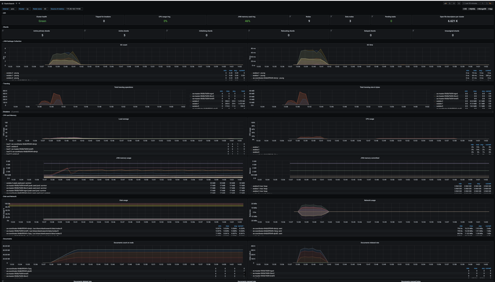


nyc-taxis (full log output [here](../rally/results/storageOS/2nd-run/nyc_taxis/nyc.log)):
```log
----------------------------------
[INFO] SUCCESS (took 4779 seconds)
----------------------------------
```

A view on metrics whilst running nyc-taxis:

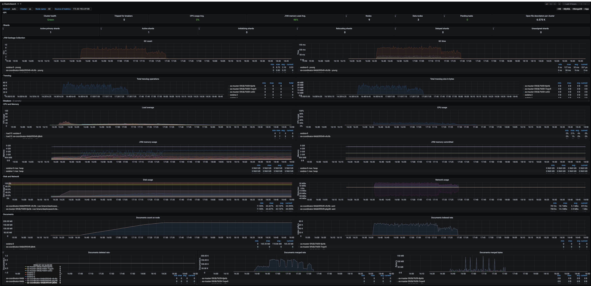

http-logs (full log output [here](../rally/results/storageOS/2nd-run/http-logs/http-logs.log)):
```log
----------------------------------
[INFO] SUCCESS (took 4179 seconds)
----------------------------------
```

A view on metrics whilst running http-logs:

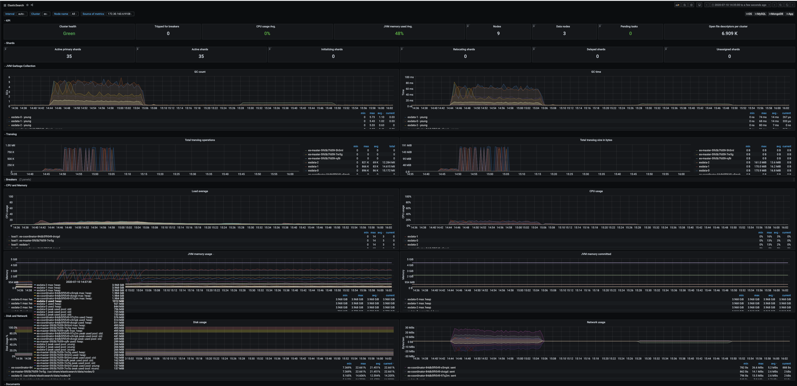


#### Linstor

  **1st run**

geopoint (full log output [here](../rally/results/linstor/1st-run/geopoint.log))::
```log
----------------------------------
[INFO] SUCCESS (took 1305 seconds)
----------------------------------
```
nyc-taxis (full log output [here](../rally/results/linstor/1st-run/nyc.log)):
```log
----------------------------------
[INFO] SUCCESS (took 4418 seconds)
----------------------------------
```

  **2nd run**

geopoint (full log output [here](../rally/results/linstor/2nd-run/geopoint/geopoint.log)):
```log
----------------------------------
[INFO] SUCCESS (took 1288 seconds)
----------------------------------
```

A view on metrics whilst running geopoint:

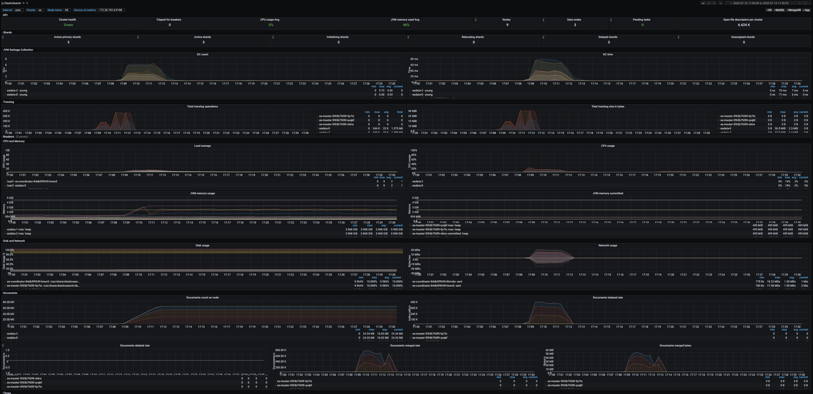

nyc-taxis (full log output [here](../rally/results/linstor/2nd-run/nyc_taxis/nyc.log)):
```log
----------------------------------
[INFO] SUCCESS (took 4334 seconds)
----------------------------------
```

A view on metrics whilst running nyc-taxis:

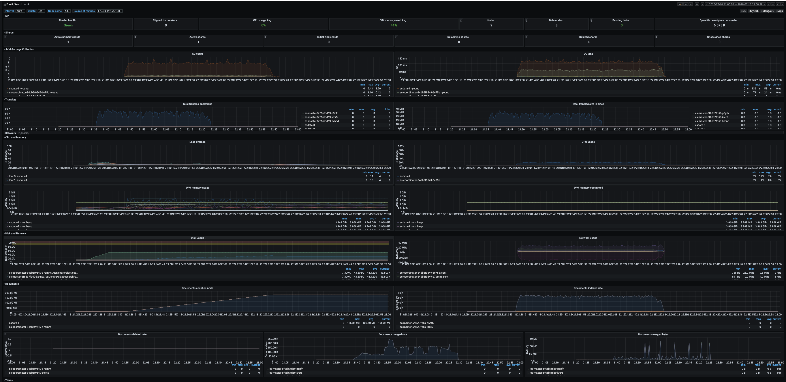

http-logs (full log output [here](../rally/results/linstor/2nd-run/http-logs/http.log)):
```log
----------------------------------
[INFO] SUCCESS (took 3938 seconds)
----------------------------------
```

A view on metrics whilst running http-logs:

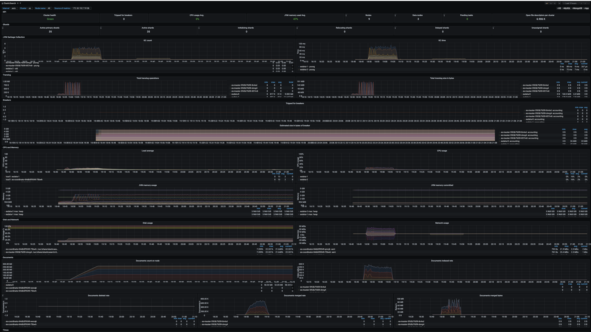


These tests tooks a while to complete, over an hour for nyc/http-logs and over 20 minutes for geopoint.

There is a consistent winner from the results on the overall speed at which the tests were completed, however, you can see these are really just marginal and it's worth deep diving in to the outputs fully to get an understanding of where each performs best as both sometimes beat the other on throughput and latency:

1. Linstor
2. StorageOS


### Failover planned

For planned failover testing, Elasticsearch was deployed, then esRally was used to run nyc-taxis, during which (after 30 minutes), one of the kubernetes nodes was drained, forcing Elasticsearch nodes to failover.

For full details and steps used to achieve this, please take a look [here](../failover-tests/).

Results for this (these are just snippets from log outputs, full results and grafana dashboards can be viewed [here](../failover-tests/)):

#### Linstor

nyc-taxis (full log output can be found [here](../failover-tests/planned/linstor/nyc.log)):
```log
----------------------------------
[INFO] SUCCESS (took 5499 seconds)
----------------------------------
```

A view on metrics during planned failover and running nyc-taxis:

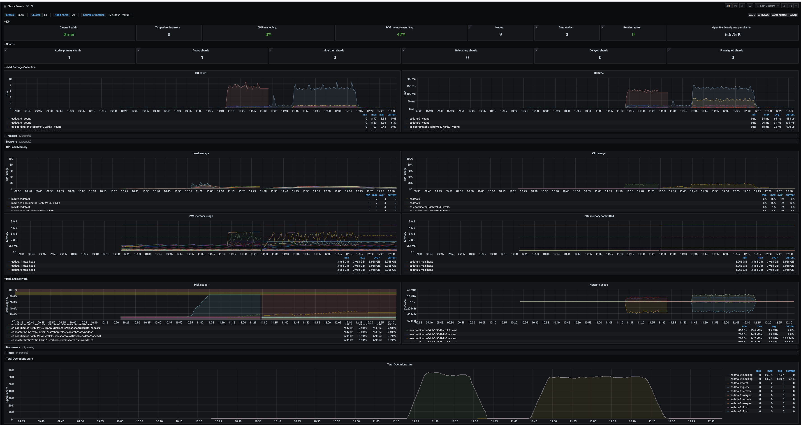


#### StorageOS

nyc-taxis (full log output can be found [here](../failover-tests/planned/storageOS/nyc.log)):
```log
----------------------------------
[INFO] SUCCESS (took 4942 seconds)
----------------------------------
```

A view on metrics during planned failover and running nyc-taxis:

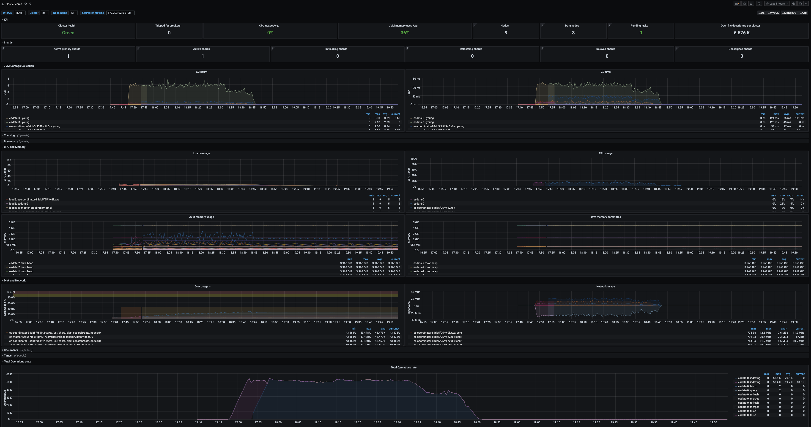


#### Results

The results above are just snippets for the time it took to run through all tests.

If you look through the log outputs, you can see both performed very similar, at some point StorageOS was better, then sometimes Linstor got the edge.

Comparing results during maintenance, StorageOS seemed slightly more consistent and comfortable compared to previous tests without maintenance.

1. StorageOS
2. Linstor

### Failover unplanned

For unplanned failover testing, Elasticsearch was deployed, then esRally was used to run nyc-taxis, during which (after 30 minutes), one of the kubernetes nodes was shutdown, forcing Elasticsearch nodes to failover.

**To Note**

Kubernetes healthchecks were not in place. In order to simulate this, after 5min of node faulure, once the failed node was in a `NotReady` state and pods were stuck in `terminating`, the Kubernetes node object was deleted.

For both storage solutions, it was also necessary to delete the failed node from the storage cluster. This is something both vendors will soon be fixing in upcoming releases.

For full details and steps used to achieve this, please take a look [here](../failover-tests).

Results for this are (these are just snippets from log outputs, full results and grafana dashboards can be viewed [here](../failover-tests)):

#### StorageOS

nyc-taxis (full log output can be found [here](../failover-tests/unplanned/storageOS/nyc.log)):
```log
----------------------------------
[INFO] SUCCESS (took 5125 seconds)
----------------------------------
```

A view on metrics during unplanned failover and running nyc-taxis:

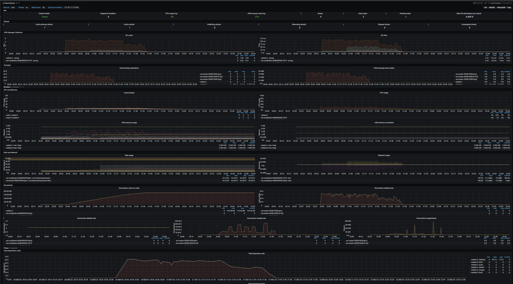

#### Linstor

nyc-taxis (full log output can be found [here](../failover-tests/unplanned/linstor/nyc.log)):
```log
----------------------------------
[INFO] SUCCESS (took 5291 seconds)
----------------------------------
```

A view on metrics during unplanned failover and running nyc-taxis:

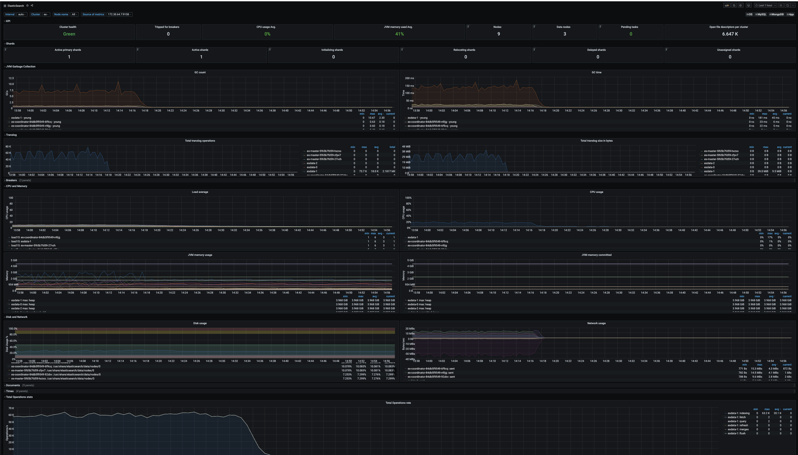


It's very close between these 2 products but a close win for StorageOS:

1. StorageOS
2. Linstor


### Kafka Concurrent Tests

The final test, again just sticking with Linstor and StorageOS, was running multiple Kafka performance tests at the samne time using the same client tool which was run previously.

3 tests were run at once (anymore than this was really pushing the cluster resources beyond its limit).

Full details on how this was achieved can be found [here](../kafka#concurrent-tests)

Here's the results:

#### StorageOS

Producer1 (full log output can be found [here](../kafka/multi-jobs/results/storageOS/producer1.log)):
```log
600000 records sent, 123001.230012 records/sec (117.30 MB/sec), 386.42 ms avg latency, 1074.00 ms max latency
```
Consumer1 (full log output can be found [here](../kafka/multi-jobs/results/storageOS/consumer1.log)):
```log
start.time, end.time, data.consumed.in.MB, MB.sec, data.consumed.in.nMsg, nMsg.sec, rebalance.time.ms, fetch.time.ms, fetch.MB.sec, fetch.nMsg.sec
2020-07-06 15:32:18:047, 2020-07-06 15:32:26:768, 572.2046, 65.6123, 600000, 68799.4496, 3025, 5696, 100.4573, 105337.0787
```
Producer2 (full log output can be found [here](../kafka/multi-jobs/results/storageOS/producer2.log)):
```log
60000000 records sent, 218073.970691 records/sec (20.80 MB/sec), 124.34 ms avg latency, 2344.00 ms max latency
```
Consumer2 (full log output can be found [here](../kafka/multi-jobs/results/storageOS/consumer2.log)):
```log
start.time, end.time, data.consumed.in.MB, MB.sec, data.consumed.in.nMsg, nMsg.sec, rebalance.time.ms, fetch.time.ms, fetch.MB.sec, fetch.nMsg.sec
2020-07-06 15:32:18:079, 2020-07-06 15:33:41:885, 5722.0459, 68.2773, 60000000, 715939.1929, 8051, 75755, 75.5336, 792026.9289
```
Producer3 (full log output can be found [here](../kafka/multi-jobs/results/storageOS/producer3.log)):
```log
60000000 records sent, 222275.733047 records/sec (21.20 MB/sec), 307.41 ms avg latency, 3222.00 ms max latency
```
Consumer3 (full log output can be found [here](../kafka/multi-jobs/results/storageOS/consumer3.log)):
```log
start.time, end.time, data.consumed.in.MB, MB.sec, data.consumed.in.nMsg, nMsg.sec, rebalance.time.ms, fetch.time.ms, fetch.MB.sec, fetch.nMsg.sec
2020-07-06 15:32:18:007, 2020-07-06 15:33:35:988, 5722.0459, 73.3774, 60000000, 769418.1916, 3051, 74930, 76.3652, 800747.3642
```

A view on metrics whilst running multiple Kafka tests:

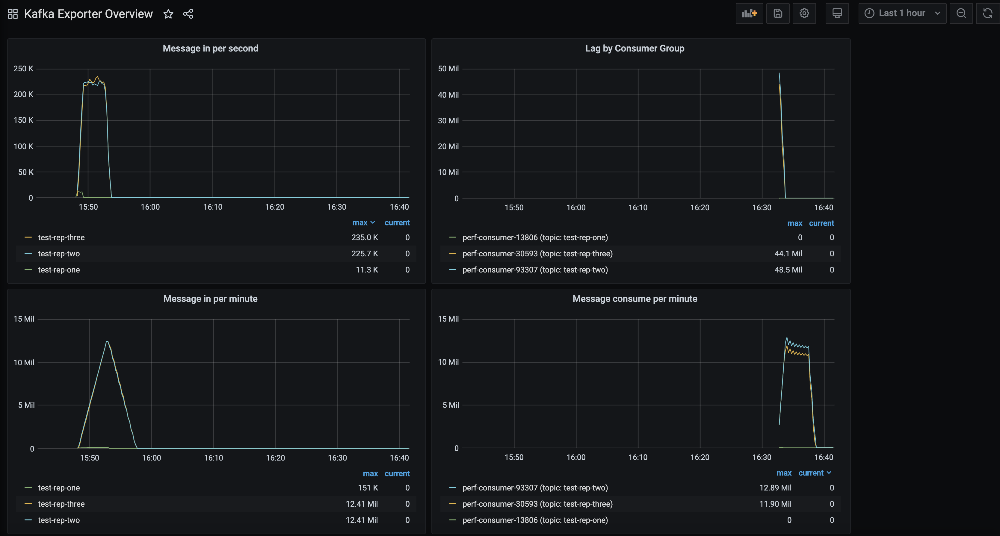

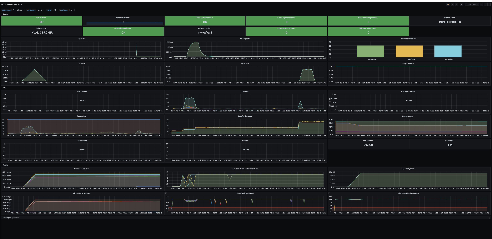


#### Linstor

Producer1 (full log output can be found [here](../kafka/multi-jobs/results/linstor/producer1.log)):
```log
600000 records sent, 83810.588071 records/sec (79.93 MB/sec), 631.34 ms avg latency, 1801.00 ms max latency
```
Consumer1 (full log output can be found [here](../kafka/multi-jobs/results/linstor/consumer1.log)):
```log
start.time, end.time, data.consumed.in.MB, MB.sec, data.consumed.in.nMsg, nMsg.sec, rebalance.time.ms, fetch.time.ms, fetch.MB.sec, fetch.nMsg.sec
2020-07-06 11:56:23:151, 2020-07-06 11:56:32:364, 572.2046, 62.1084, 600000, 65125.3663, 3038, 6175, 92.6647, 97165.9919
```
Producer2 (full log output can be found [here](../kafka/multi-jobs/results/linstor/producer2.log)):
```log
60000000 records sent, 198423.196995 records/sec (18.92 MB/sec), 255.70 ms avg latency, 3716.00 ms max latency
```
Consumer2 (full log output can be found [here](../kafka/multi-jobs/results/linstor/consumer2.log)):
```log
start.time, end.time, data.consumed.in.MB, MB.sec, data.consumed.in.nMsg, nMsg.sec, rebalance.time.ms, fetch.time.ms, fetch.MB.sec, fetch.nMsg.sec
2020-07-06 11:56:23:143, 2020-07-06 11:57:46:707, 5722.0459, 68.4750, 60000000, 718012.5413, 3018, 80546, 71.0407, 744915.9487
```
Producer3 (full log output can be found [here](../kafka/multi-jobs/results/linstor/producer3.log)):
```log
60000000 records sent, 202126.369406 records/sec (19.28 MB/sec), 477.77 ms avg latency, 5845.00 ms max latency
```
Consumer3 (full log output can be found [here](../kafka/multi-jobs/results/linstor/consumer3.log)):
```log
start.time, end.time, data.consumed.in.MB, MB.sec, data.consumed.in.nMsg, nMsg.sec, rebalance.time.ms, fetch.time.ms, fetch.MB.sec, fetch.nMsg.sec
2020-07-06 11:56:28:101, 2020-07-06 11:57:46:035, 5722.0459, 73.4217, 60000000, 769882.2080, 3014, 74920, 76.3754, 800854.2445
```

A view on metrics whilst running multiple Kafka tests:

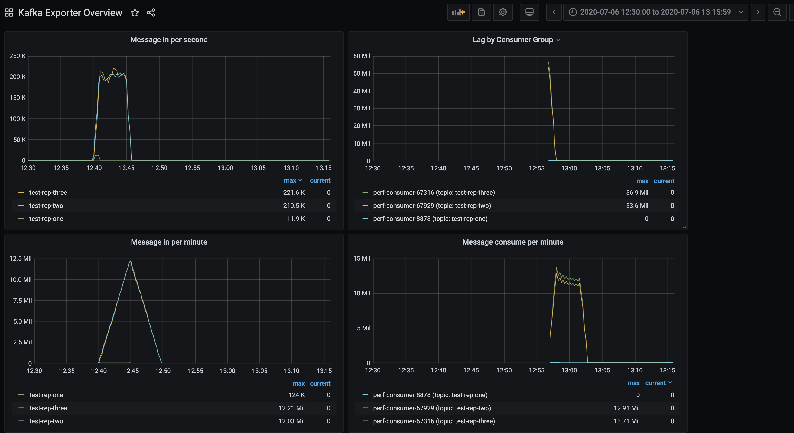


#### Results

There is a clear consistent winner here, StorageOS has better throughput and latency on each test.

1. StorageOS
2. Linstor

## Important to note

Linstor does not automatically re-allocate volume replicas when nodes are drained or fail. This gave it an unfair advantage during failover tests as it has less work to do, even though it still got out performaned during these by StorageOS. You have to run the following command for each pvc:

```bash
linstor resource-definition auto-place pvc-...
```
This is a dealbreaker in it's current state as it's just too complicated to do this even at small scale. Linstor are aware and have this fix in the works.

Upgrades:

Upgrading any storage solution generally is a pain to do and involves downtime when using storageOS, or at best draining nodes and upgrading one node at a time.

Linstor seems to handle all this better, from what I've been informed is its pretty much just upgrading helm chart and it will just update everything without downtime.

If the drbd version needs to be updated, then this is a different story and same thing would apply, downtime or node drains.


## Conclusion

After researching and implementing these products, its clear they are all extremely well thought out and capable solutions.

All work better than others depending on circumstances and test cases, infact the results of these tests could make the decision to choose the right solution even harder :)

All are pretty trivial to implement and make managing storage in Kubernetes seem simple and easy. The idea of deploying stateful services in to Kubernetes now does not feel like such a scary, crazy idea.

2 of the 4 products tested seemed to stand out slightly, just on consistency with performance tests, these were StorageOS and Linstor. Longhorn just had some inconsistent results especially with FIO and it doesn't have sophisticated scheduling, no ecryption and overall less mature but this is defintely promising for the future. 

Portworx was just a little underwhleming on performance, given the price point, it should have completely crushed the competition but never did and was always in the middle or bottom. It is a great product though, very easy to set up with a fantasic support team and great documentaion, they offer a great free version package if using less than 5TiB and is much more feature rich and mature compared to others. It just fell short overall in most tests.

So which one wins? 

On performance, you can't really choose as they are so close, perhaps StorageOS just edged it on results and consistency.

Its very difficult, neither would make a a bad choice. StorageOS feels simpler to use and set up, the documentation is much better written and presented, the local volumes are striped and presented as one volume to the csi, making things much easier to expand. Linstor has many things you can fine tune, it's wildcard is its rdma compatiblity, so if you've got that hardware (nics & switches), you can use this instead of tcp/ip and bypass the hosts os layer.

StorageOS needs to improve its scheduling to ensure pods and volumes are always located on same nodes, something they are working on.

Linstor needs to fix replica re-scheduling, this require manual work. A GUI would be nice too!

Both need to fix reconciling nodes if k8s nodes are deleted.

If I had to choose I would go with StorageOS at this stage, that's just down to it's simplicity and performance, although more real world testing at scale would perhaps be necessary to truly split them.


